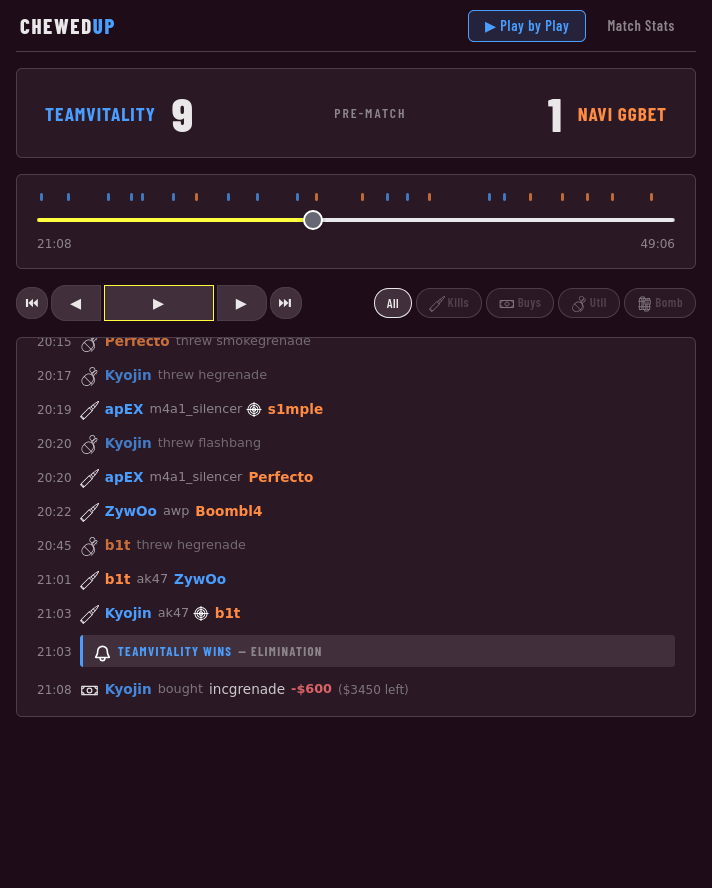
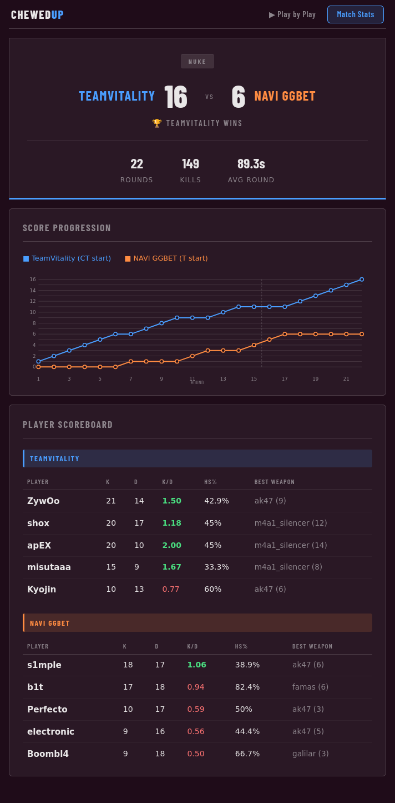

# Blast Chewed Up Code Challenge
This is my submission to the Blast Chewed Up Code Challenge. This repository contains the frontend and the backend to display a Counter Strike match read from a match log.

## Design/styling

The styling of the page is loosely based on the [blast.tv](https://blast.tv/cs) webpage.

<div style="display: flex; gap: 10px; align-items: flex-start;">
  
  
</div>

## Tech Stack

| Layer    | Technology                          |
|----------|-------------------------------------|
| Backend  | C# - ASP.NET Core 10 - Web API      |
| Frontend | React - TypeScript - Vite           |
| Styling  | CSS                                 |


## Getting started

### Prerequisites

- [.NET 10 SDK](https://dotnet.microsoft.com/download)
- [Node.js 22+](https://nodejs.org/en/download)

### Backend

```bash
cp NAVIvsVitaGF-Nuke.txt backend/BlastStatApi/match.log
cd backend/BlastStatApi
dotnet run
```
 

### Frontend
```bash
cd frontend && npm install && npm run dev
```


# Code Challenge Access

The [code challenge](http://chewedup.blast.tv/) is hidden behind a scrambled Caesar cipher.

**Solution**: `crocobot chewed my match notes` or simply access the page [here](https://chewedup.blast.tv/25b26a68f13bdac00fbd37029e736ee4dbbd6974eacd23ea7f590bd589710dee.html).


# Attributions
**Logo and icons**:
- Battery Jumper by Murat Mustafa from <a href="https://thenounproject.com/browse/icons/term/battery-jumper/" target="_blank" title="Battery Jumper Icons">Noun Project</a> (CC BY 3.0)
- Defuse by Creative Mahira from <a href="https://thenounproject.com/browse/icons/term/defuse/" target="_blank" title="defuse Icons">Noun Project</a> (CC BY 3.0)
- Weapons collection by [SVG Repo](https://www.svgrepo.com/collection/weapons-6/) (CC0 License)